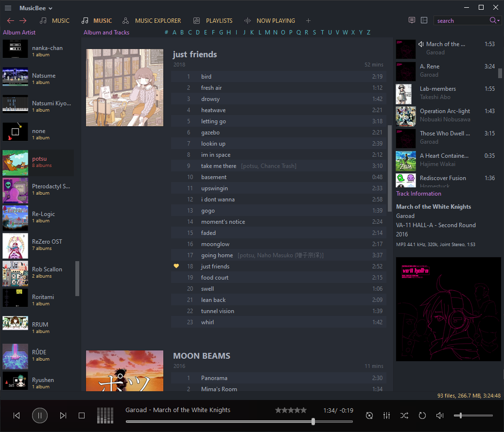

# MusicBee One Dark

A recolor of the amazing [Fluenx Dark](https://getmusicbee.com/addons/skins/233/fluenx-dark-hidpi-supported/) in Atom's default One Dark theme.

Colors are taken from the [Vim](https://github.com/joshdick/onedark.vim) and [VSCode](https://marketplace.visualstudio.com/items?itemName=zhuangtongfa.Material-theme) extensions.

### Example:

